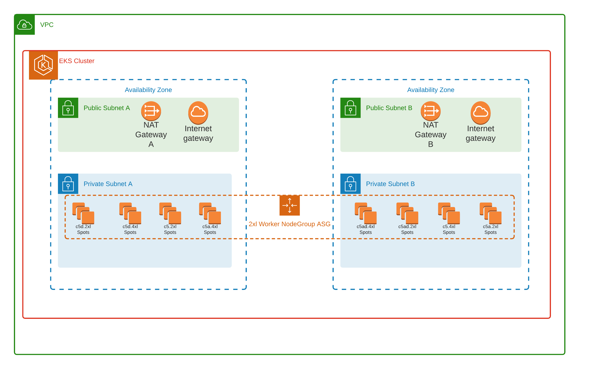

# Description
This is CloudFormation Stack which describeas EKS Cluster with managed Node Group based on Spots.

## Stack Resourse:
 - New VPC with 10.0.0.0/16 IP range spread on two Availability Zones.
 - Public Subnet A with range 10.0.1.0/24
 - Public Subnet B with range 10.0.3.0/24
 - Private Subnet A with range 10.0.2.0/24
 - Private Subnet B with range 10.0.4.0/24
 - Internet Gateway attached to Public Subnet A.
 - Internet Gateway attached to Public Subnet B.
 - NAT Gateway For Private Subnet A attached to Public Subnet A.
 - NAT Gateway For Private Subnet B attached to Public Subnet B.
 - All required routing tables.
 - Secuirty Group For EKS Master.  
 - Secuirty Group For EKS Nodes.  
 - EKS Master version 1.15.
 - Launch Template required for tagging Managed node with custom Tags. 
 - Spot Based Managed Node Group. 
 
# Architecture Diagram

## Stack Input:
 - Stack Name
 - Your IP Address required for secuirty group.

## Stack Output
 - VPC's default Security Group ID. Required for spot Diversification Lambda.
 - aws command required to configure connection to created EKS cluster.    

